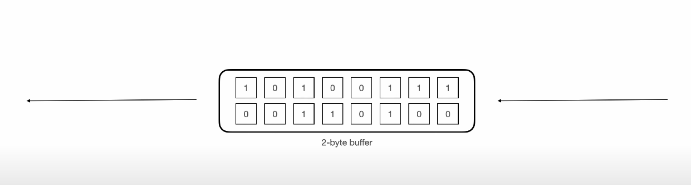

# NODE JS

## Buffers :

- Its a contain in ram and has fix length

- Pure JS, which is great with unicode-encoded string, does not handle straight binary data very well and this Behaviourist is fine on  browser where most of the data is in the form of string.
- However nodeJs server have to deal with TCP streams and reading and writing to the file system, these all operation make node js necessary to deal with purely binary streams of data

## Streams:

Data comes in small chunks and you perform some operations on chunks. As more chunks of data comes you continue. Without waiting for all the data to come and wait.

- **Writable Stream** : write data in chunks.
- **Readable Stream** : read data in chunks.
- **Duplex Stream** : Both Read and Write data at same time.
- **Transform Stream** : Want to process data in between or before writting. E.g read data -> encrypts data -> write data to file.

**Writable Stream:**

- Each writable stream has internal buffer( 16 kb ). It has also has methods, events and properties.
- **stream_obj.writbaleHighWaterMark** gives size of buffer. Also **stream_obj.writableLength** property tells how much buffer is filled.
- As you write data it gets stored in Buffer. Once buffer gets filled. You write all the data of buffer to destination in one go.
- Instead of writting data 8 times to the disk. You collect it and write in single call/write.

## Readable Stream:**

- In Readable Stream when you want to empty buffer **stream.on('data',(chunk)=>{})** is used. Default **highWaterMark** value is 64 KB.

- In Readable Stream you will automatically have **stream.on('end')** event once reading is done. While in Writable Stream you will have manually emit **stream.end()** after that you will enter in **stream.on('finish')**.

## Duplex Stream:**

- It can do Read and Write both at a same time. It has **2** buffer one for Reading and another for writting. You could have one buffer reading data from another source and second buffer writting data to different source.
- Both buffers are completely isolated.

## ****Transform Stream****

- It is similar to Duplex Stream but It reads data and writes back to write internal buffer then it becomes transform stream. Special case of Duplex Stream.

